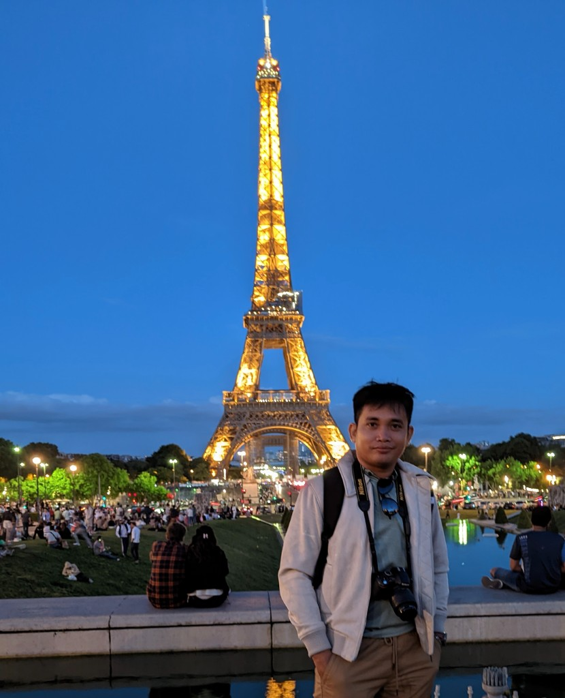

::: {.portfolio-hero}

# Sophal Chan

Certified CompTIA CySA+ professional at the intersection of **Cybersecurity**, **AI Engineering**, **Data Analytics**, and **Quantum Science**. Building intrusion detection systems, real-time anomaly dashboards, and data-driven security solutions for engineering teams and recruiters who need production-ready technical depth.

::: {.hero-tags}
Cybersecurity
AI / ML
Data Science and Analyst
Quantum Science
:::

:::

## Featured Projects

Browse **cybersecurity**, **AI/ML**, **data science**, and **quantum science** work below—including **21 projects** in the [**Data Science Projects Collection**](posts/data-science-collection/) from [PaulChanCyber/Data-Science-Project-](https://github.com/PaulChanCyber/Data-Science-Project-).

Use the sidebar **category filters** to explore projects, or search by keyword. Publications: **[Research & Academic](research.qmd)**.

::: {#portfolio-listing}
:::
